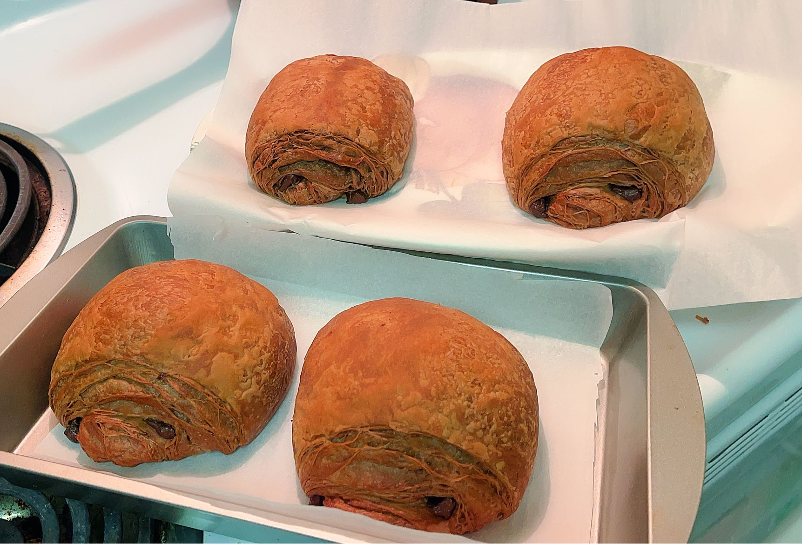
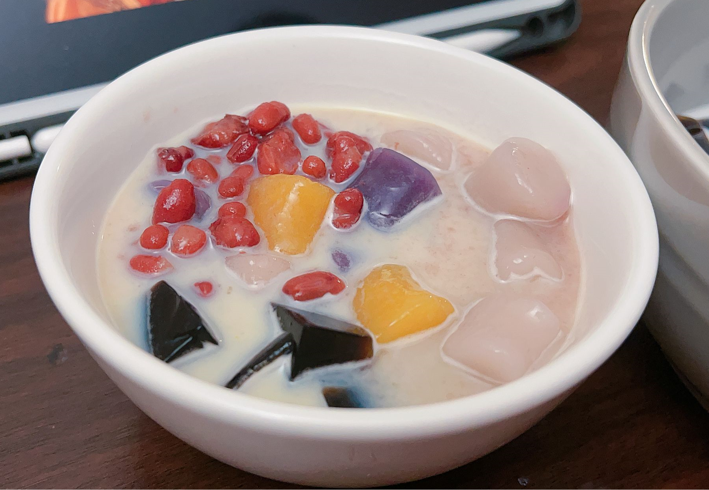
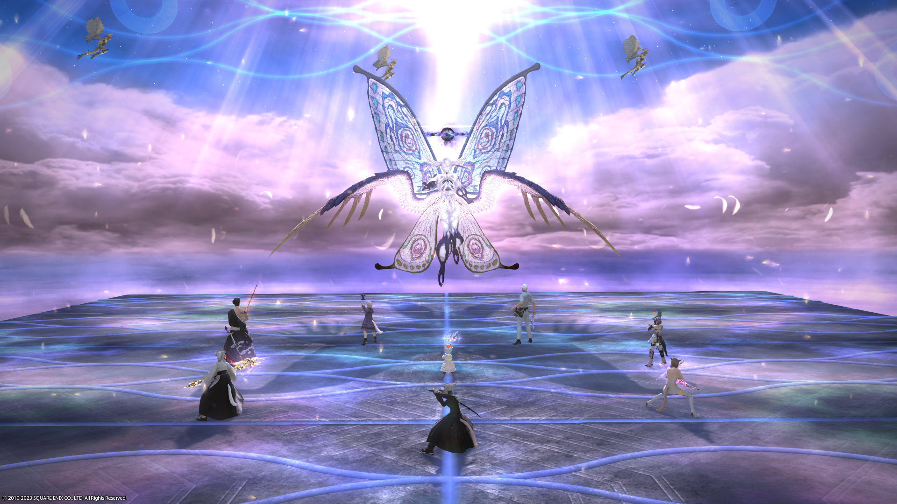

If you've heard of the MBTI, then I'm an intp type of person (I'm convinced of it myself). However, it doesn't affect my enjoyment of life at all. I am grateful for what life has given me.

### I love cooking!

  <table>
    <tr>
      <td></td>
      <td></td>
      <td></td>
    </tr>
    <tr>
      <td></td>
      <td></td>
      <td></td>
    </tr>
    </table>

### I enjoy the time playing video games
Both multiplayer games with my friends and independent games myself.

  <table>
    <tr>
      <td></td>
      <td></td>
    </tr>
    <tr>
      <td></td>
      <td></td>
    </tr>
  </table>

