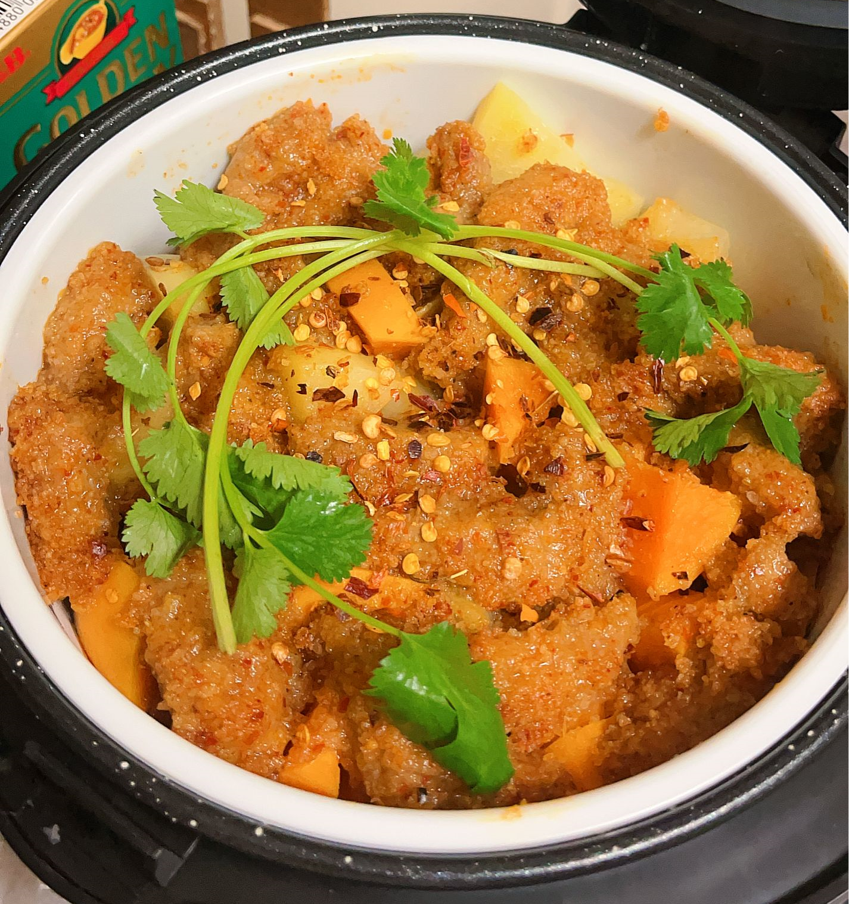
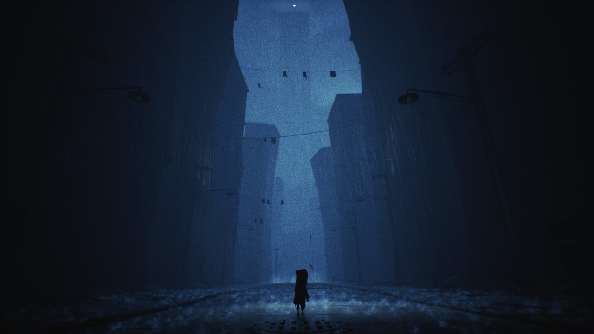

If you've heard of the MBTI, then I'm an INTP type of person and enjoying my life.

### I love cooking!

  <table>
    <tr>
      <td></td>
      <td></td>
      <td></td>
    </tr>
    <tr>
      <td></td>
      <td></td>
      <td></td>
    </tr>
    </table>

 <be>

### I enjoy the time playing video games
Both multiplayer games with my friends and independent games.

  <table>
    <tr>
      <td></td>
      <td></td>
    </tr>
    <tr>
      <td></td>
      <td></td>
    </tr>
  </table>

